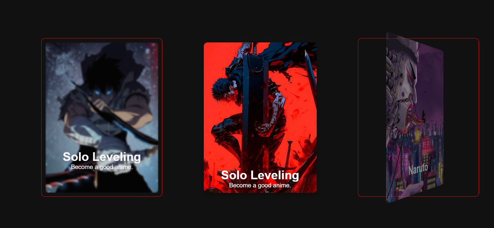

# Output




# Detail

## So this project use css

```
    perspective: 1000px;
```
> Which is use in container like:

```
/* 3d container */
.container {
    padding: 10px;
    border-radius: 10px;
    border: 1px solid red;
    perspective: 1000px;
}
```

> That when card use :
```
transform: rotateX() // like 3d
transform: rotateY() // like 3d
transform: rotateZ() // like 3d

```

> Middle Card is an Example!🚀

## You can use this code as example to use in slide animation or hover animation as you like it 👀🕊️

